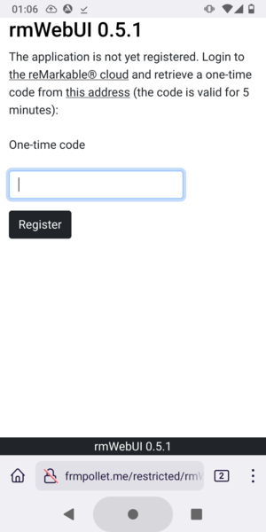
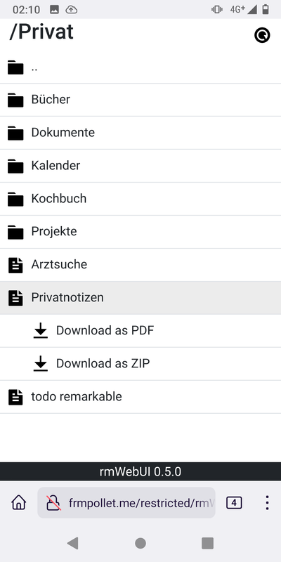

# rmWebUI

rmWebUI is a simple web interface for the reMarkable&reg; cloud designed primarily for small screens. It includes the following features:

- Register application
- Browse collections
- Refresh collections
- Download a document as ZIP (original data)
- Download a document as PDF (convert using [rmrl](https://github.com/rschroll/rmrl))
- Cache downloaded files based on version. Download from the cloud only as needed.




# Install

## Prepare the distribution files

Run:

```
composer run deploy
```

This will create a `dist/` folder with all required files.

## Configure

The file `data/config.json` contains a few configuration options:

- `mode`: Either `debug` or `prod`. In debug mode, PHP error messages will be activated.
- `cache`: If true, files will be cached and only downloaded/converted as needed. This will allow faster access but will use space on your webserver.
- `rmrl`: By default, notebooks are downloaded as a ZIP file containing the metadata and lines files in the proprietary format of reMarkable&reg;. rmWebUI is also capable of converting the files to PDF by using [rmrl](https://github.com/rschroll/rmrl). To activate this feature, use this option to specify the command for running rmrl (typically it should be `python -m rmrl` or `python3 -m rmrl` but it may differ depending on your system configuration). Be aware that RMRL has limitations and may not work properly with some documents. When this feature is configured, both ZIP and PDF downloads are available.

## Prepare the webserver

You need a webserver with PHP 7.2 or further.

If you use RMRL, you also need to install Python 3.7 or further and [rmrl](https://github.com/rschroll/rmrl). Make sure to install rmrl as either root or the user running the webserver.

## Deploy

Copy the content of the `dist/` folder to your webserver and make sure the webserver has write permission to `data/`.

## Important security warning

rmWebUI doesn't implement any kind of authentication. Configure your webserver as needed to prevent unauthorized access, for example by using a `.htaccess` file (for Apache). Make sure that subdirectories and files are protected as well (especially `data/` and `data/cache/`).

For example, you can put the following `.htaccess` file into the base directory of rmWebUI:
```
AuthType Basic
AuthName "rmWebUI"
AuthUserFile /var/www/.htpasswd
Require valid-user

RewriteOptions InheritDown
```

and create the password file `/var/www/.htpasswd`.

See the Apache documentation for more information:

- [Authentication and Authorization](https://httpd.apache.org/docs/2.4/howto/auth.html)
- [htpasswd](https://httpd.apache.org/docs/2.4/programs/htpasswd.html)

# Register application

On the first run, you will be asked to register the application. This is required to access your files on the reMarkable&reg; cloud. Once the application is registered, you don't need to do it again. You will be asked again if the application fails to connect to the cloud or if you clear the content of the file `data/auth.json`.

# License

&copy; 2021-2022 Fabien Pollet <polletfa@posteo.de>

rmWebUI is licensed under the MIT license. See the LICENSE file for details.

# Trademarks

reMarkable&reg; is a registered trademark of reMarkable AS. rmWebUI is not affiliated with, or endorsed by, reMarkable AS. The use of “reMarkable” in this work refers to the company’s e-paper tablet product(s).